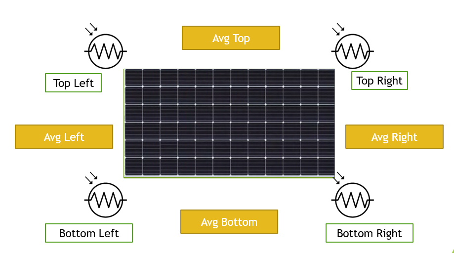
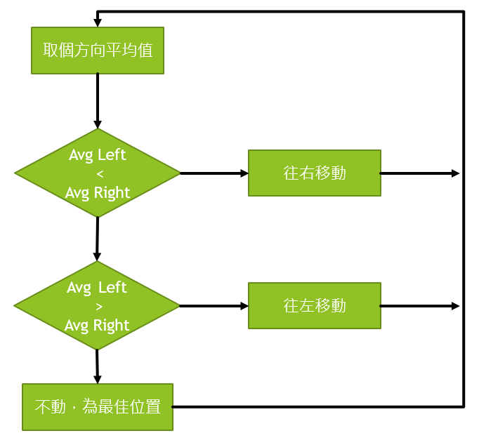
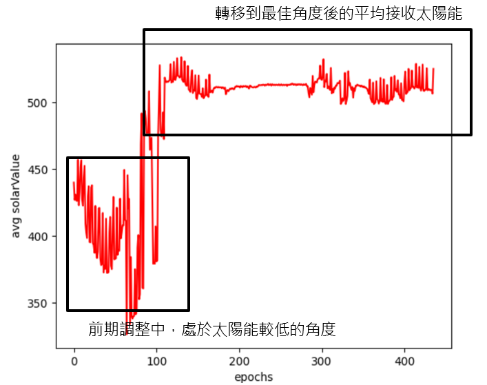
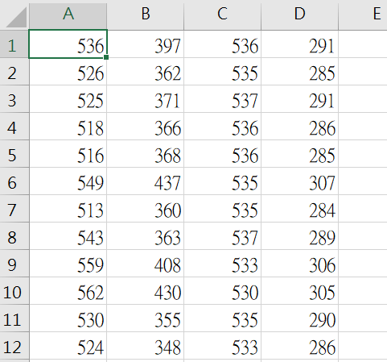
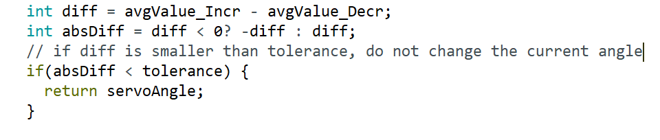

# SolarTracker System

## 報告內容：

建立可自動調整角度，隨時都能獲得最佳產能的太陽能系統。並在此基礎上，將太陽能板生產過程產生的相關資訊，如電壓、電流等等，以時間為分段製作相關報表。使客戶能夠遠端監控相關系統，並依造系統狀況傳遞指令。

## 自動控制內容：

1. 以光敏電阻偵測陽光仰角，調整太陽能板角度以獲得最佳生產效能
2. 透過 Serial 通訊傳遞太陽能板的電壓、電流等相關資訊，以 pySerial 接收，建立即時可視化界面，以及儲存該次連線訊息。

## 太陽能自動追蹤運作原理

這次太陽能追蹤系統使用了 4 個光敏電阻作為環境感應器，分別擺放於太陽能板的各角落。擺放於各角落的方式，使各移動方向(Top, Bottom, Left, Right)都可以取兩個感應器值平均來獲得 Avg 量測值(如 Top Left 與 Bottom Left 取平均成 Avg Left，以此類推，下圖橘黃色方框內)。

獲得四大方向的平均值後，分成左右，上下兩種移動軸向依序處理，兩移動軸處理方式一樣。以左右移動軸為例，由於光亮越高時，量測值會越高，因此比較 Avg Left 以及 Avg Right，向量測值較高的方向移動，使太陽能平面能接收更多光線。

由於左右與上下這兩移動軸的處理流程一樣，因此將處理流程包裝成函式 axisMove(int, int, int)，進一步降低程式耦合，以及可閱讀性。

## 監控系統運作原理

利用 python 模組 pyserial，與 Arduino 序列埠進行連線並溝通。太陽能追蹤系統(簡稱 solarTracker)會將資料以 Serial.print()的方式上傳序列埠，而 python 透過 pyserial.readline()獲得序列埠內容，再進一步使用 decode()對序列埠上資料解碼並儲存，並同時進行報表呈現，並在程式關閉時進行資料儲存。

透過即時監控圖可以發現，solarTracker 可以由太陽能接收較差的角度，逐漸轉移到更好的角度，並一路維持穩定，保證太陽能有最佳產出。

同時，我們也可以由此圖，去判斷當前的 solarTracker 系統是否運作正常，來判斷是否有需要維修的需求。不需由維修人員實際去一一確認。

在最後程式關閉時，會將該次連線的資訊全部儲存至 .csv 檔案裡。可用於後續的資料追蹤，或是以建立大數據找出太陽軌跡，建立更佳的太陽能追蹤系統。

## 設計時遇到困難與解決方式

### 過度靈敏

#### 問題：

光敏電阻過度靈敏，使得其最佳角度會不斷調整，造成 solarTracker 不斷抖動的狀況。

#### 解法：

新增一個容許值變數 tolerance=10，當`|avgRight-avgLeft|<tolerance` 或是`|avgBot-avgTop|<tolerance`，也就是兩者差異介於容許值之間時，不進行修正。藉由容許些微的不最佳化，來減去抖動的問題。

